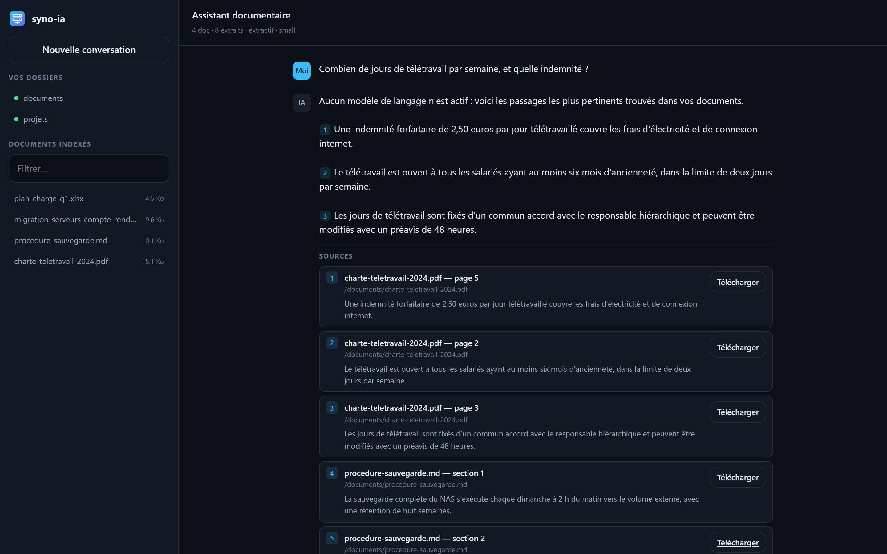

# syno-ia

**Votre RAG privé, sur votre NAS Synology, avec *vos* permissions.**

`syno-ia` est une application web auto-hébergée, dans l'esprit d'AnythingLLM, mais conçue
pour un NAS Synology : vous posez une question en français, elle cherche la réponse dans
**vos documents** et la restitue avec ses sources.

Sa particularité : **chaque utilisateur se connecte avec son compte DSM** et n'obtient de
réponses que sur les documents auxquels **DSM l'autorise réellement**. Aucune fuite entre
services, aucun document RH qui ressort dans le chat d'un stagiaire.

Rien ne sort du NAS : indexation, recherche et génération se font en local (un service
distant reste optionnel si vous le souhaitez).



*Marie est connectée avec son compte DSM. La barre latérale ne liste que `documents` et
`projets` : le partage `rh`, auquel elle n'a pas accès, n'apparaît pas — et son contenu
ne peut pas remonter dans les réponses.*

---

## Sommaire

- [Pourquoi ce projet](#pourquoi-ce-projet)
- [Fonctionnalités](#fonctionnalités)
- [Configuration DSM](#configuration-dsm)
- [Installation sur le NAS](#installation-sur-le-nas)
- [Modèle de sécurité](#modèle-de-sécurité)
- [Prérequis](#prérequis)
- [Profils matériels et choix des modèles](#profils-matériels-et-choix-des-modèles)
- [Variables d'environnement](#variables-denvironnement)
- [Utilisation](#utilisation)
- [Architecture](#architecture)
- [Dépannage](#dépannage)
- [Limites connues](#limites-connues)
- [Licence](#licence)

---

## Pourquoi ce projet

Synology réserve ses fonctions d'IA locale aux modèles récents et bien dotés. Un DS218+,
lui, n'aura jamais « AI Console ». Pourtant, avec 8 Go de RAM, il est parfaitement capable
de faire tourner un RAG utile.

Les solutions existantes (AnythingLLM, Open WebUI, Dify…) savent faire du RAG, mais elles
gèrent leurs **propres** utilisateurs et leur **propre** silo de documents. Aucune ne sait
dire : « cet utilisateur DSM n'a pas le droit de lire `/volume1/rh`, donc il ne doit jamais
voir passer le moindre extrait de ce partage. »

C'est exactement le problème que `syno-ia` résout.

---

## Fonctionnalités

- 🔐 **Authentification DSM native** — les comptes du NAS, y compris la double
  authentification (OTP), avec option *appareil de confiance*. Aucun compte à créer,
  aucun mot de passe stocké.
- 🛡️ **RAG cloisonné par les permissions DSM** — filtrage à deux niveaux (partages puis
  fichiers), systématiquement *fail-closed*.
- 🔎 **Recherche hybride** — BM25 (SQLite FTS5) + similarité vectorielle, fusionnées par
  *Reciprocal Rank Fusion*. Fonctionne bien même sur de petits corpus.
- 📄 **Formats courants** — PDF, DOCX, PPTX, XLSX, CSV, HTML, Markdown, JSON, code source
  et ~30 extensions texte, avec localisation de la source (page, diapositive, onglet).
- 🧠 **Modèles adaptés au matériel** — détection de la RAM, des cœurs et des jeux
  d'instructions SIMD, puis sélection automatique des embeddings et du LLM.
- 💬 **Réponses citées, en flux** — chaque affirmation renvoie à `[1]`, `[2]`… cliquables
  et ouvrant le document d'origine. Le moteur utilisé et les temps de réponse sont affichés.
- 🪶 **Mode extractif** — sans aucun LLM, l'application répond en citant les passages
  pertinents. Utile sur un NAS vraiment modeste.
- 🌍 **Interface français / anglais**, thème clair / sombre, sans étape de build.
- 🐳 **Un seul conteneur**, aucune base externe, aucun service tiers obligatoire.

---

## Configuration DSM

> Ces quatre étapes sont à réaliser **avant** l'installation : le conteneur a besoin
> du compte de service dès son premier démarrage, et refusera de dialoguer avec DSM
> tant que les droits et le pare-feu ne sont pas en place.

### 1. Créer un compte de service

**Panneau de configuration → Utilisateur et groupe → Créer**

- Nom : **`syno-ia-svc`** — c'est la valeur déjà inscrite dans `.env.example` ; en la
  réutilisant telle quelle, vous n'aurez que le mot de passe à renseigner.
- Mot de passe : long et aléatoire
- **Permissions de dossier partagé** : *lecture seule* sur les partages à indexer, *aucun
  accès* ailleurs. Le compte n'a pas besoin d'être administrateur.
- **Applications** : autorisez **File Station**. C'est indispensable — sans ce droit,
  toutes les requêtes échouent avec le code `160`.
- Désactivez la double authentification pour ce compte de service (sinon la connexion
  automatique est impossible).

Reportez le mot de passe dans `.env` (`DSM_SERVICE_PASSWORD`) ; `DSM_SERVICE_ACCOUNT` y
vaut déjà `syno-ia-svc`.

### 2. Autoriser les utilisateurs

Les utilisateurs qui se connecteront à `syno-ia` doivent eux aussi avoir le droit
d'application **File Station** — c'est ce droit qui permet à `syno-ia` de vérifier leurs
permissions en leur nom.

### 3. Pare-feu et Auto Block

Le conteneur joint DSM par la passerelle du bridge Docker (`172.17.0.1:5000`).

- **Panneau de configuration → Sécurité → Pare-feu** : si un pare-feu est actif, ajoutez
  une règle d'autorisation pour la source `172.17.0.0/16` vers le port `5000`, **au-dessus**
  de toute règle de blocage.
- **Panneau de configuration → Sécurité → Protection → Blocage auto** : ajoutez
  `172.17.0.0/16` à la **liste d'autorisation**. Tous les conteneurs partagent cette
  adresse source : sans cela, un autre conteneur qui échoue ses connexions pourrait faire
  bloquer `syno-ia` — et réciproquement.

`syno-ia` limite lui-même les dégâts : après un refus d'identifiants du compte de service,
il **cesse** de réessayer jusqu'à une reconnexion manuelle depuis le panneau
d'administration.

### 4. HTTPS

Par défaut, `DSM_URL=http://172.17.0.1:5000` : le trafic ne quitte pas la machine. Pour
utiliser HTTPS, mettez `https://172.17.0.1:5001` et laissez `DSM_VERIFY_SSL=false` si le
certificat DSM est auto-signé.

Pour exposer `syno-ia` lui-même en HTTPS — une fois l'application installée — placez-le
derrière le **Reverse Proxy** de DSM (Panneau de configuration → Portail de connexion →
Reverse Proxy) en activant `WebSocket`/`HTTP/1.1` et en désactivant la mise en tampon des
réponses (le chat utilise des flux SSE).

---

## Installation sur le NAS

Le compte de service de l'étape précédente doit exister : notez son nom et son mot de
passe, ils sont demandés dans le fichier `.env`.

> **Si vous déployez votre propre fork.** GitHub publie les paquets GHCR en *privé* par
> défaut, même pour un dépôt public : le NAS recevrait alors `unauthorized` au
> `docker pull`. Après la première exécution réussie du workflow, passez le paquet en
> *Public* depuis ses réglages
> (`https://github.com/users/<vous>/packages/container/syno-ia/settings`), ou exportez
> `GHCR_USER` et `GHCR_TOKEN` (portée `read:packages`) avant d'appeler
> `deploy/deploy-nas.sh`. L'image officielle de ce dépôt est déjà publique.

### Quels dossiers seront indexés ?

**Rien n'est indexé automatiquement.** L'application ne lit que les dossiers déclarés dans
`INDEX_ROOTS`, dont la valeur par défaut est `/volume1/homes` — les dossiers personnels.
Aucun autre partage du NAS n'est touché tant que vous ne l'ajoutez pas : un partage absent
de cette liste reste totalement invisible, pour tout le monde.

Les permissions interviennent **ensuite** : parmi les dossiers indexés, chaque utilisateur
ne voit que ce que DSM l'autorise à lire. Déclarer un partage ne le rend donc pas public,
mais ne pas le déclarer le rend définitivement absent.

**Faut-il monter ces dossiers ?** Deux modes, au choix :

| | `INDEX_MODE=mount` *(défaut)* | `INDEX_MODE=filestation` |
|---|---|---|
| Montages `-v` | un par partage à indexer | **aucun** |
| Lecture des fichiers | directe sur le disque | via l'API DSM (compte de service) |
| Vitesse d'indexation | rapide | plus lente, plus de réseau |
| Sécurité | **identique** : les ACL DSM sont rejouées dans les deux cas | |

Le mode `mount` est recommandé sur un DS218+, dont le CPU est déjà limité. Si vous
préférez ne rien monter, passez simplement `INDEX_MODE=filestation` et omettez les `-v`
de partage (celui de `/app/data` reste nécessaire).

> **Les dossiers personnels (`homes`) sont indexés par défaut.**
> Chaque utilisateur y retrouve **ses propres documents**, et uniquement les siens.
> DSM présente le dossier personnel sous l'alias `/home`, alors que le compte de service
> qui indexe voit le partage parent `/homes` ; `syno-ia` rejoue cette traduction au moment
> du contrôle d'accès, si bien qu'un seul index suffit — les dossiers partagés ne sont
> jamais indexés en double. Le dossier d'un tiers reste `/homes/<tiers>`, nom qui n'existe
> pas pour un utilisateur ordinaire : il est écarté avant même d'interroger DSM.
> Seul un **administrateur**, à qui DSM montre `/homes`, y a accès — comme dans File Station.
>
> Prérequis : le service **Dossier personnel utilisateur** doit être activé dans DSM
> (*Panneau de configuration → Utilisateur et groupe → Avancé*). En mode `filestation`, le
> compte de service doit en outre appartenir au groupe **administrators** pour parcourir
> `/homes` ; en mode `mount`, la lecture se fait sur le disque et aucun droit particulier
> n'est requis.

### Installation par SSH

```bash
ssh admin@<ip-du-nas>

sudo mkdir -p /volume1/docker/apps/syno-ia/data
cd /volume1/docker/apps/syno-ia

# 1. Configuration de départ
curl -fsSL https://raw.githubusercontent.com/flake9025/syno-ia/main/.env.example -o .env

# 2. Clé de signature des sessions (à générer avant le premier démarrage)
echo "APP_SECRET=$(openssl rand -hex 32)" >> .env

# 3. Mot de passe du compte de service créé à l'étape « Configuration DSM »
vi .env          # DSM_SERVICE_PASSWORD

# 4. Démarrage — cette commande fonctionne telle quelle
sudo docker run -d \
  --name syno-ia \
  -p 8083:8080 \
  --env-file /volume1/docker/apps/syno-ia/.env \
  -e INDEX_MODE=mount \
  -e INDEX_ROOTS=/volume1/homes \
  -v /volume1/docker/apps/syno-ia/data:/app/data \
  -v /volume1/homes:/volume1/homes:ro \
  --memory=5g \
  --restart unless-stopped \
  ghcr.io/flake9025/syno-ia:latest
```

Par défaut, `syno-ia` indexe les **dossiers personnels** : `/volume1/homes` existe sur
tout NAS dont le service *Dossier personnel utilisateur* est activé, et chaque utilisateur
n'y retrouvera que les siens. Rien à adapter.

Pour ajouter des **dossiers partagés**, repérez d'abord leurs noms exacts :

```bash
ls -1 /volume1/
```

Vous obtenez la liste réelle de vos partages — `Documents`, `Projets`, `photo`… Ajoutez
ceux qui vous intéressent à `INDEX_ROOTS` (séparés par des virgules) et montez-les chacun,
en respectant la casse :

```bash
  -e INDEX_ROOTS=/volume1/homes,/volume1/Documents,/volume1/Projets \
  -v /volume1/homes:/volume1/homes:ro \
  -v /volume1/Documents:/volume1/Documents:ro \
  -v /volume1/Projets:/volume1/Projets:ro \
```

Ouvrez ensuite `http://<ip-du-nas>:8083` et connectez-vous avec **votre compte DSM
habituel** — pas avec le compte de service, qui ne sert qu'aux vérifications internes.

> ⚠️ **Montez chaque partage au chemin identique à celui du NAS.**
> La syntaxe est `-v <chemin sur le NAS>:<chemin dans le conteneur>:ro`, et les deux
> doivent être **les mêmes** : `-v /volume1/Projets:/volume1/Projets:ro`. Cette identité
> est ce qui permet de faire correspondre un fichier indexé à son chemin DSM, donc de
> rejouer ses ACL. Un montage vers `/data/docs` casserait cette correspondance.
> Le suffixe `:ro` monte en lecture seule : l'application ne peut jamais écrire dans vos
> documents.
>
> Vous n'indexez que ce que vous montez : un partage absent de cette liste reste
> totalement invisible, pour tout le monde.

### Variante avec LLM 100 % local

Même commande, avec l'image `:latest-llm` — elle embarque `llama.cpp` compilé **sans
AVX**, seule variante qui fonctionne sur les Celeron « Apollo Lake » (DS218+, DS718+,
DS918+) :

```bash
# 4 bis. Démarrage avec LLM local
sudo docker run -d \
  --name syno-ia \
  -p 8083:8080 \
  --env-file /volume1/docker/apps/syno-ia/.env \
  -e INDEX_MODE=mount \
  -e INDEX_ROOTS=/volume1/homes \
  -v /volume1/docker/apps/syno-ia/data:/app/data \
  -v /volume1/homes:/volume1/homes:ro \
  --memory=5g \
  --restart unless-stopped \
  ghcr.io/flake9025/syno-ia:latest-llm
```

Puis, depuis le panneau d'administration, onglet **Modèles** : *Télécharger le modèle
recommandé*. Le fichier GGUF (229 Mo pour le profil `nano`, ~1 Go pour `small`) est stocké
dans `/app/data/models` et survit aux mises à jour.

Tant que le modèle n'est pas téléchargé, `LLM_BACKEND=auto` laisse l'application en mode
extractif ; elle bascule toute seule sur `llamacpp` dès que le fichier est présent.

### Mettre à jour

Reprenez **la même étiquette qu'au démarrage** : `:latest-llm` avec le LLM local,
`:latest` sinon. Se tromper d'étiquette remplace silencieusement l'image par une
variante dépourvue de `llama.cpp`.

```bash
sudo docker pull ghcr.io/flake9025/syno-ia:latest-llm
sudo docker stop syno-ia && sudo docker rm syno-ia
# puis relancez la commande « docker run » ci-dessus, à l'identique
```

`docker rm` ne supprime que le conteneur : l'index, les appareils mémorisés et les
modèles GGUF résident dans `/volume1/docker/apps/syno-ia/data` et sont conservés.

Pour vérifier que la nouvelle image tourne réellement, ouvrez
`http://<adresse-du-nas>:8083/api/health` : `build` porte l'empreinte du commit déployé
et `uptime` repart de zéro. Le panneau ⚙️ → *Modèles* reflète lui aussi la version : si
le modèle `nano` n'y figure pas, c'est que l'ancienne image tourne encore.

### Variante sans aucun montage

Mêmes paramètres, mais `INDEX_MODE=filestation` et plus aucun montage de partage — seul
celui des données de l'application subsiste :

```bash
sudo docker run -d \
  --name syno-ia \
  -p 8083:8080 \
  --env-file /volume1/docker/apps/syno-ia/.env \
  -e INDEX_MODE=filestation \
  -e INDEX_ROOTS=/volume1/homes \
  -v /volume1/docker/apps/syno-ia/data:/app/data \
  --memory=5g \
  --restart unless-stopped \
  ghcr.io/flake9025/syno-ia:latest
```

`INDEX_ROOTS` reste obligatoire : il désigne toujours les dossiers à parcourir, qui sont
cette fois lus par l'API DSM au lieu du disque.

---

## Modèle de sécurité

C'est le cœur du projet, donc détaillons.

### 1. L'utilisateur s'authentifie auprès de DSM, pas auprès de `syno-ia`

```
Navigateur ──(compte + mot de passe DSM)──> syno-ia ──> SYNO.API.Auth (session=FileStation)
                                                   <── sid personnel
```

- `syno-ia` ne stocke **aucun** mot de passe et n'a **aucune** base d'utilisateurs.
- Le `sid` DSM **ne quitte jamais le serveur**. Le navigateur reçoit un jeton opaque signé
  (HMAC-SHA256) dans un cookie `HttpOnly`, `SameSite=Lax`.
- Les sessions vivent **en mémoire uniquement** : un redémarrage du conteneur déconnecte
  tout le monde. C'est volontaire — aucun identifiant ne touche le disque.
- Le statut administrateur est lu depuis DSM (`SYNO.FileStation.Info` → `is_manager`).

**Appareil de confiance.** Si votre compte DSM utilise la double authentification, le code à
usage unique est réclamé à chaque connexion. Cochez *Faire confiance à cet appareil* en saisissant
le code : DSM émet alors un jeton d'appareil que `syno-ia` conserve dans un second cookie signé,
valable `DEVICE_TRUST_DAYS` jours (30 par défaut).

- Le **mot de passe reste exigé** à chaque connexion : seul le second facteur est allégé.
- Le jeton est lié au compte qui l'a obtenu : il ne dispense pas un autre utilisateur du code.
- Il survit à la déconnexion (c'est tout l'intérêt) ; pour l'oublier, décochez la case lors d'une
  connexion avec code. Révoquer l'appareil depuis DSM le neutralise également.
- `DEVICE_TRUST_DAYS=0` désactive complètement la fonction.

### 2. Chaque réponse est filtrée avec le `sid` de l'utilisateur

```
Question ──> recherche hybride sur TOUT l'index (rapide, local)
         ──> 1) pré-filtre : partages visibles par l'utilisateur (list_share avec SON sid)
         ──> 2) vérification : getinfo par lots avec SON sid → applique les ACL avancées
         ──> seuls les extraits survivants alimentent le contexte du LLM
```

Le compte de service (utilisé pour l'indexation) **ne sert jamais** à répondre à un
utilisateur. Il ne sert qu'à lire les fichiers pendant l'indexation et à cartographier les
chemins réels des partages.

**Dossiers personnels.** L'index enregistre les documents personnels sous
`/homes/<compte>`, nom que voit le compte de service. Or DSM ne montre jamais `/homes` à
un utilisateur ordinaire : son propre dossier lui apparaît sous l'alias `/home`. Les deux
étapes ci-dessus traduisent donc `/homes/<compte>` en `/home` **pour le seul propriétaire
du dossier**. Le dossier d'un tiers conserve son nom `/homes/<tiers>`, introuvable dans la
liste des partages de l'utilisateur : il est écarté à l'étape 1, sans même interroger DSM.
Un index unique suffit, et les dossiers partagés ne sont jamais dupliqués.

### 3. *Fail-closed*, toujours

Un document est masqué dès qu'il y a le moindre doute :

| Situation | Décision |
|---|---|
| Partage absent de `list_share` | refusé |
| Chemin absent de la réponse `getinfo` | refusé |
| Entrée `getinfo` portant un code d'erreur | refusé |
| `perm.acl.read = false` ou `adv_right.disable_list` | refusé |
| Erreur réseau ou API pendant la vérification | refusé |
| Session DSM expirée | 401, reconnexion demandée |

Le téléchargement d'un document (`/api/document`) **revalide** les droits au moment de la
requête : un fichier déjà cité dans une réponse ancienne ne sera pas servi si les
permissions ont changé entre-temps.

### 4. Ce que ce modèle ne couvre pas

- L'index (`data/syno-ia.db`) contient le **texte de tous les documents indexés**, sans
  cloisonnement interne. Le cloisonnement est appliqué à la lecture, pas au stockage.
  Protégez ce fichier comme vous protégeriez les documents eux-mêmes.
- Un administrateur de `syno-ia` voit les statistiques d'indexation (nombre de documents
  par partage, chemins) via le panneau d'administration.
- Les permissions sont mises en cache pendant `ACL_CACHE_TTL` (5 min par défaut). Un
  retrait de droit dans DSM peut donc mettre jusqu'à 5 minutes à prendre effet. Réduisez
  cette valeur si votre contexte l'exige.

---

## Prérequis

| Élément | Minimum | Recommandé |
|---|---|---|
| DSM | 7.0 | 7.2+ |
| Paquet | Container Manager (ou Docker) | Container Manager |
| Architecture | x86_64 ou ARM64 | x86_64 |
| RAM totale du NAS | 2 Go | 8 Go |
| RAM libre pour le conteneur | ~1 Go | 4 Go et plus |
| Espace disque | 2 Go (image + modèles) | 5 Go |

> **NAS ARM d'entrée de gamme** (DS220j, DS120j…) : l'image ARM64 est publiée, mais avec
> 512 Mo à 1 Go de RAM, seul le **mode extractif** est réaliste. Le LLM local est hors de
> portée ; visez plutôt un service distant (`LLM_BACKEND=openai` ou `ollama`).

> **DS218+ / DS718+ / DS918+ et autres Celeron « Apollo Lake »** : ces processeurs **ne
> possèdent pas AVX**. Les paquets `llama-cpp-python` précompilés du commerce sont bâtis
> avec AVX2 et provoquent un `Illegal instruction` immédiat. L'image `:latest-llm` de ce
> dépôt contient une compilation **explicitement sans AVX** — c'est la seule qui fonctionne
> sur ces machines.

---

## Profils matériels et choix des modèles

Au démarrage, `syno-ia` lit `/proc/cpuinfo`, `/proc/meminfo` et les limites cgroup du
conteneur, puis calcule **deux** niveaux indépendants :

- **mémoire** — ce qu'il est possible de charger ;
- **calcul** — `nombre de cœurs × facteur SIMD` (AVX2 ≈ 1.6, AVX ≈ 1.15, sinon 1.0), soit
  ce qu'il est raisonnable d'exécuter sans latence insupportable.

Le profil de génération retenu est le **minimum des deux**, avec un cran de tolérance
lorsque la mémoire est abondante — réservé aux processeurs dotés d'AVX ou de NEON, car
la mémoire ne compense pas un processeur lent. À l'inverse, un processeur **dépourvu de
toute instruction vectorielle** descend d'un cran supplémentaire, jusqu'au palier `nano`.

| Profil | RAM disponible | Calcul | LLM local | Prompt | Embeddings |
|---|---|---|---|---|---|
| `nano` | < 1,5 Go | sans SIMD | LFM2 350M Q4_K_M (229 Mo) | 2 000 car. | model2vec `potion-multilingual-128M` |
| `micro` | < 1,5 Go | faible | Qwen2.5 0.5B Q4_K_M | 3 500 car. | model2vec `potion-multilingual-128M` |
| `small` | 1,5 – 3 Go | modeste | Qwen2.5 1.5B Q4_K_M | 5 000 car. | model2vec `potion-multilingual-128M` |
| `medium` | 3 – 7 Go | correct | Qwen2.5 3B Q4_K_M | 7 000 car. | fastembed `paraphrase-multilingual-MiniLM-L12-v2` |
| `large` | > 7 Go | AVX2, 4 cœurs+ | Qwen2.5 7B Q4_K_M | 10 000 car. | fastembed `multilingual-e5-large` |

La colonne *Prompt* suit le profil de génération : c'est le processeur, et non la
mémoire, qui doit relire le contexte avant de produire le premier mot.

> **Le LLM ne fait pas la recherche.** Les documents sont trouvés par BM25 et les
> embeddings ; le modèle ne fait que reformuler les passages déjà sélectionnés. Un tout
> petit modèle suffit donc parfaitement, et le [mode extractif](#variables-denvironnement)
> (`LLM_BACKEND=none`) répond même sans aucun LLM.

### Cas concret : DS218+ avec 8 Go

| Mesure | Valeur |
|---|---|
| Processeur | Intel Celeron J3355, 2 cœurs, **sans AVX** |
| Niveau mémoire | `medium` |
| Niveau calcul | `micro` (score ≈ 2,0) |
| **Profil retenu** | **`nano`** — LFM2 350M Q4_K_M, 229 Mo |
| Taille du prompt | 2000 caractères, 3 extraits |
| Fils de génération | 1 — le second cœur reste au serveur web |
| Embeddings | model2vec (statiques, pas d'ONNX : trop lent sans AVX) |

LFM2 350M est conçu pour l'embarqué et reste **multilingue, français compris**. Il est
30 % plus petit que Qwen2.5 0.5B et nettement plus rapide sur un processeur sans AVX.

La mémoire abondante n'accorde **aucun** cran de tolérance ici : sans AVX, un modèle
trois fois plus gros serait trois fois plus lent sans rien apporter. Pour la même raison,
**la taille du prompt suit le processeur et non la mémoire** : le contexte doit être relu
entièrement avant le premier mot de la réponse, et 8 Go de RAM ne font pas lire plus vite
un Celeron. Pour gagner encore en réactivité, deux alternatives :

1. **Mode extractif** (`LLM_BACKEND=none`) — réponse instantanée constituée des passages
   pertinents cités. Pas de reformulation, mais immédiat et toujours exact.
2. **LLM distant** — un PC du réseau avec Ollama (`LLM_BACKEND=ollama`), ou un service
   compatible OpenAI. L'indexation et le filtrage ACL restent sur le NAS ; seuls les
   extraits déjà autorisés sont transmis.

Le profil peut être forcé : `HARDWARE_PROFILE=nano|micro|small|medium|large`. Changer de
profil ne touche qu'au LLM : le modèle d'embeddings suit la mémoire, l'index vectoriel
déjà construit reste donc valide. Si le modèle du nouveau profil n'est pas encore
téléchargé, un modèle déjà présent est utilisé en attendant.

#### Accélérer les réponses

| Levier | Effet |
|---|---|
| `HARDWARE_PROFILE=nano` | Modèle le plus petit (350M) **et** prompt le plus court : le réglage le plus rapide. |
| `LLM_MAX_TOKENS=350` | Plafonne la longueur des réponses, donc l'attente maximale. |
| `CONTEXT_MAX_CHARS=1500` | Prompt plus court à analyser avant le premier jeton. |
| `RETRIEVAL_TOP_K=3` | Moins d'extraits envoyés au modèle. |
| `LLM_TIMEOUT_SECONDS=90` | Arrête la génération plus tôt et renvoie ce qui est prêt. |
| `LLM_BACKEND=none` | Réponses extractives, instantanées. |

Chaque réponse affiche le moteur réellement utilisé et le temps passé (total, premier jeton,
jetons/seconde) : de quoi mesurer l'effet de ces réglages sans quitter l'interface.

Au-delà de `LLM_TIMEOUT_SECONDS` (120 s par défaut), la génération est **arrêtée net** et
le texte déjà produit est conservé, accompagné d'un avertissement. Le NAS ne reste donc
jamais bloqué sur une réponse interminable, et llama.cpp cesse aussitôt de consommer les
cœurs. Si le délai expire **sans le moindre mot** — modèle trop lourd pour la machine —
l'application bascule sur la réponse extractive et cite les passages trouvés : vous obtenez
toujours quelque chose d'exploitable. `0` lève la limite.

#### Faire de la place

⚙️ → *Modèles* liste le catalogue avec la taille des fichiers déjà téléchargés. Le bouton
**Supprimer** efface le GGUF du NAS. Si le modèle supprimé était en service, le moteur est
reconstruit aussitôt : il se rabat sur un autre modèle installé, ou sur le mode extractif.

---

## Variables d'environnement

Fichier complet et commenté : [`.env.example`](.env.example). L'essentiel :

| Variable | Défaut | Description |
|---|---|---|
| `APP_SECRET` | *(aléatoire)* | Clé de signature des cookies. **À fixer** en production. |
| `DSM_URL` | `http://172.17.0.1:5000` | DSM vu depuis le conteneur. |
| `DSM_SERVICE_ACCOUNT` / `DSM_SERVICE_PASSWORD` | `syno-ia-svc` / — | Compte de service pour l'indexation. |
| `ADMIN_ACCOUNTS` | *(vide)* | Comptes DSM admin de `syno-ia` en plus des admins DSM. |
| `INDEX_MODE` | `mount` | `mount` (partages montés) ou `filestation` (API DSM). |
| `INDEX_ROOTS` | `/volume1/homes` | Racines à indexer, séparées par des virgules. Par défaut les dossiers personnels ; ajoutez vos dossiers partagés (`ls -1 /volume1/`) et montez-les aux mêmes chemins. |
| `INDEX_INTERVAL_MINUTES` | `360` | Réindexation automatique (`0` = désactivée). |
| `ACL_STRICT` | `true` | Vérification fichier par fichier des ACL avancées. |
| `ACL_CACHE_TTL` | `300` | Durée de vie d'une décision d'accès (secondes). |
| `SESSION_TTL_MINUTES` | `720` | Durée d'une session web. |
| `DEVICE_TRUST_DAYS` | `30` | Durée de validité d'un appareil approuvé, dispensé du code 2FA (`0` = désactivé). Le mot de passe reste toujours exigé. |
| `EMBEDDING_BACKEND` | `auto` | `auto`, `model2vec`, `fastembed`, `none`. |
| `EMBEDDING_MODEL` | *(selon profil)* | Dépôt Hugging Face. En mode `fastembed`, le modèle **doit** figurer dans le catalogue ONNX (`TextEmbedding.list_supported_models()`), sinon l'application bascule automatiquement sur model2vec. |
| `EMBEDDING_ASYNC_LOAD` | `true` | Charge le modèle en arrière-plan (voir [Premier démarrage](#premier-démarrage)). `false` rend le démarrage bloquant. |
| `EMBEDDING_BACKFILL_BATCH` | `64` | Fragments vectorisés par lot lors du rattrapage. |
| `LLM_BACKEND` | `auto` | `auto`, `llamacpp`, `ollama`, `openai`, `none`. |
| `LLM_TIMEOUT_SECONDS` | `120` | Délai maximal d'une génération ; au-delà, la réponse est tronquée proprement, ou remplacée par les extraits trouvés si aucun mot n'a été produit (`0` = sans limite). |
| `LLM_THREADS` | `0` | Fils de calcul llama.cpp. `0` = automatique : **un cœur reste toujours libre** pour que le serveur continue de répondre pendant la génération. Ne montez à `cpu_count` qu'au prix de redémarrages intempestifs. |
| `OLLAMA_URL` | `http://172.17.0.1:11434` | Ollama local ou distant. |
| `OPENAI_API_KEY` | *(vide)* | Service compatible OpenAI. |
| `HARDWARE_PROFILE` | `auto` | Forçage du profil (`nano`…`large`). |

En mode `auto`, le LLM est choisi dans cet ordre : service compatible OpenAI (si une clé
est présente) → Ollama (s'il répond) → `llama.cpp` local (si un modèle est présent) →
**mode extractif**.

---

## Utilisation

1. Ouvrez `http://<ip-du-nas>:8083` et connectez-vous avec votre compte DSM.
2. La barre latérale affiche les partages indexés **que vous pouvez consulter**.
3. Posez votre question. Les réponses arrivent en flux, avec des citations `[1]`, `[2]`…
   cliquables qui ouvrent le document source. Sous chaque réponse figurent le moteur
   utilisé et les temps mesurés.
4. Les administrateurs disposent d'un panneau (⚙️) : état du matériel, avancement de
   l'indexation, téléchargement et suppression de modèles, sessions actives, reconnexion DSM.

La première indexation d'un corpus de quelques milliers de documents prend de 20 minutes à
plusieurs heures sur un DS218+. Elle est incrémentale : les exécutions suivantes ne
retraitent que ce qui a changé (taille ou date de modification).

### Premier démarrage

Au tout premier lancement, le modèle d'embeddings doit être téléchargé depuis Hugging
Face — quelques centaines de mégaoctets, soit plusieurs minutes sur la liaison d'un NAS
domestique. **L'application n'attend pas** : elle répond immédiatement en recherche
lexicale (BM25), pleinement utilisable, et bascule en recherche hybride dès que le moteur
est prêt.

Concrètement :

1. L'interface est accessible en quelques secondes ; le bandeau sous les réponses indique
   *« le moteur sémantique se prépare encore »*.
2. L'indexation peut démarrer en parallèle : les documents sont découpés et interrogeables
   par mots-clés tout de suite.
3. Dès que le modèle est chargé, les fragments déjà indexés sont vectorisés par lots —
   **sans réindexation**, les documents n'étant ni relus ni redécoupés.
4. Le panneau d'administration (⚙️ → *Aperçu* → *Moteur*) affiche l'état :
   `chargement du modèle…`, puis `vectorisation 320/1200`, puis `recherche hybride active`.

C'est aussi ce qui évite une panne silencieuse : un chargement bloquant pouvait dépasser le
délai du *healthcheck* Docker, qui relançait alors le conteneur — lequel recommençait le
téléchargement depuis le début, indéfiniment.

Le même mécanisme s'applique après un changement de `EMBEDDING_MODEL` : les vecteurs dont
la dimension ne correspond plus sont recalculés en arrière-plan.

---

## Architecture

```
┌──────────────────────────────────────────────────────────────┐
│ Navigateur — HTML/CSS/JS sans build, SSE pour le flux         │
└───────────────────────────┬──────────────────────────────────┘
                            │ cookie de session signé (HttpOnly)
┌───────────────────────────▼──────────────────────────────────┐
│ FastAPI                                                       │
│  ├─ auth        SYNO.API.Auth → sid conservé côté serveur     │
│  ├─ chat/search pipeline de récupération + génération          │
│  ├─ admin       indexation, modèles, diagnostics               │
│  └─ health      sonde Docker / CI                              │
├───────────────────────────────────────────────────────────────┤
│ Pipeline    BM25 (FTS5) ─┐                                    │
│                          ├─ RRF ─→ filtre ACL ─→ contexte      │
│             vecteurs ────┘                                     │
├───────────────────────────────────────────────────────────────┤
│ Index SQLite (WAL)   documents │ chunks │ FTS5 │ vecteurs      │
├───────────────────────────────────────────────────────────────┤
│ Indexeur    extraction → découpage → embeddings → SQLite      │
│             (vecteurs rattrapés après coup si le moteur       │
│              n'était pas encore chargé)                        │
├───────────────────────────────────────────────────────────────┤
│ DSM         list_share (partages) │ getinfo (ACL par fichier)  │
└───────────────────────────────────────────────────────────────┘
```

Choix techniques notables :

- **Un seul fichier SQLite en WAL**, pas de base vectorielle externe. Les vecteurs sont
  stockés normalisés en `float32` : le cosinus se réduit à un produit scalaire, et la
  matrice NumPy est mise en cache en mémoire, invalidée par un compteur de génération.
- **RRF (k = 60)** plutôt qu'une somme pondérée : aucune calibration de scores nécessaire
  entre BM25 et cosinus.
- **FTS5 avec `remove_diacritics 2`** : « procedure » trouve « procédure ».
- **Aucune étape de build front-end** : pas de Node, pas de bundler, pas de CVE npm.
- **Vérification ACL par lots de 20**, avec repli automatique chemin par chemin : DSM ne
  documente pas le comportement de `getinfo` en cas d'échec partiel, et un seul fichier
  supprimé depuis l'indexation ferait échouer tout le lot.
- **Chargement différé des embeddings** : le moteur est encapsulé dans un proxy
  (`DeferredEmbedder`) que le pipeline et l'indexeur interrogent à chaque appel. Le
  remplacer à chaud suffit à faire basculer l'application de BM25 vers la recherche
  hybride, sans reconstruire aucun composant ni redémarrer le service.

---

## Dépannage

| Symptôme | Cause probable | Solution |
|---|---|---|
| `NAS injoignable` à la connexion | `DSM_URL` incorrect, ou pare-feu DSM | Testez `docker exec syno-ia curl -s http://172.17.0.1:5000/webapi/query.cgi?api=SYNO.API.Info\&version=1\&method=query` |
| Erreur `160` | Droit d'application File Station manquant | Panneau de configuration → Utilisateur → onglet Applications |
| Erreur `407` | Auto Block a bloqué le sous-réseau Docker | Ajoutez `172.17.0.0/16` à la liste d'autorisation |
| Erreur `150` | L'IP de sortie du conteneur a changé | Reconnectez-vous ; évitez les réseaux Docker instables |
| `Illegal instruction` au chargement du LLM | Roue `llama-cpp-python` avec AVX2 sur un CPU sans AVX | Utilisez l'image `:latest-llm` de ce dépôt |
| Aucun résultat alors que les documents existent | Partage non visible par votre compte DSM, ou indexation non terminée | Panneau d'administration → *Indexation* ; vérifiez vos permissions DSM |
| L'indexation se fige puis redémarre | Mémoire insuffisante (OOM killer) | Augmentez `--memory`, réduisez `INDEX_BATCH_SIZE`, passez `EMBEDDING_BACKEND=model2vec` |
| Les réponses ignorent le sens des mots | Le moteur sémantique n'est pas encore prêt (BM25 seul) | Normal au premier démarrage : voir [Premier démarrage](#premier-démarrage). Suivez l'état dans ⚙️ → *Aperçu* → *Moteur* |
| `État : indisponible` dans le panneau *Moteur* | Téléchargement du modèle impossible (réseau, DNS, quota Hugging Face) | L'application reste utilisable en BM25. Rétablissez l'accès sortant du conteneur, puis relancez le chargement sans redémarrer : `POST /api/admin/embeddings/reload` |
| Réponses très lentes | Prompt trop long pour le CPU, ou LLM trop gros | Mettez l'image à jour : le prompt suit désormais le processeur. Sinon `CONTEXT_MAX_CHARS=1500`, `LLM_MAX_TOKENS=350`, ou `LLM_BACKEND=none` (extractif) |
| « Le serveur est injoignable » après une longue attente | La génération n'aboutissait pas et bloquait la requête | Mettez l'image à jour : le prompt est raccourci sur les CPU lents, et la génération s'arrête d'elle-même à `LLM_TIMEOUT_SECONDS` |
| « Le serveur est injoignable » au bout d'une minute, le conteneur a redémarré | La génération occupait **tous** les cœurs : la sonde de santé n'était plus servie | Mettez l'image à jour (`docker pull ghcr.io/flake9025/syno-ia:latest-llm`) : un cœur est désormais réservé au serveur web |
| Le modèle `nano` n'apparaît pas dans ⚙️ → *Modèles* | L'ancienne image tourne encore | Voir [Mettre à jour](#mettre-à-jour) — vérifiez l'étiquette `:latest-llm` et le champ `build` de `/api/health` |
| Le chat n'affiche rien derrière un reverse proxy | Mise en tampon des réponses SSE | Désactivez le *buffering* dans la configuration du proxy |

Journaux : `docker logs -f syno-ia`. État du service : `GET /api/health` (public, sans
aucune statistique d'index). Diagnostic complet, dont les compteurs d'indexation :
`GET /api/admin/status` (administrateurs).

---

## Limites connues

- Le comportement exact de `SYNO.FileStation.List/getinfo` en cas d'échec partiel n'est pas
  documenté par Synology. L'implémentation est défensive (repli chemin par chemin) mais
  mérite d'être validée sur votre DSM.
- DSM ne distingue pas toujours « accès refusé » de « fichier introuvable ». Dans les deux
  cas, `syno-ia` refuse — ce qui est le comportement sûr.
- Les sessions étant en mémoire, une mise à jour du conteneur déconnecte les utilisateurs.
- Le RAG ne gère pas l'OCR : un PDF scanné sans couche texte ne sera pas indexé.
- Les fichiers de plus de `INDEX_MAX_FILE_MB` (40 Mo par défaut) sont ignorés.

---

## Licence

MIT — voir [`LICENSE`](LICENSE).

Ce projet n'est ni affilié à, ni approuvé par Synology Inc. « Synology » et « DSM » sont des
marques de leurs propriétaires respectifs.
